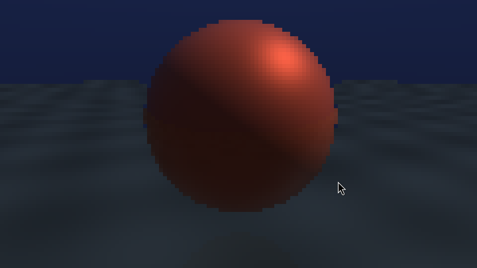

# raymarch-dd

Small SDL3 raymarcher written in Dudu.

This is a dogfooding repo for using Dudu on a real-ish graphics program. It is
not meant to be a polished renderer. The point is to stress normal systems-code
shapes: multiple Dudu source files, SDL3 imports, native C headers, value types,
operator overloads, threads, a low-resolution framebuffer, and a simple render
loop.



## Requirements

- Dudu compiler built at `~/Coding/GameDev/dudu/build/dudu`
- SDL3 available through the Dudu playground third-party install used by
  `scripts/run.sh`

The script currently sets:

```bash
PKG_CONFIG_PATH=~/Coding/GameDev/duduplayground/third_party/install/lib/pkgconfig
```

## Run

```bash
./scripts/run.sh
```

That emits C++, builds the binary, and runs it.

## What This Tests

- Direct native C imports:
  ```python
  import c "SDL3/SDL.h"
  ```
- SDL3 types and functions discovered from headers.
- Dudu value types with generated constructors.
- Dudu-native operator overloads on `Vec3`.
- A camera type composed from `Vec3` values.
- Multithreaded CPU rendering through imported `std.thread`.
- Updating an SDL streaming texture from a Dudu `list[u32]` framebuffer.

## Dudu Shortcomings Exposed

This repo found real Dudu issues:

- Native Dudu module imports currently have broken identity/re-export behavior.
  Importing the same physical module through multiple routes can create
  duplicate declarations. That is a compiler bug, not a repo design goal.
- `from module import Name as Alias` did not work for Dudu-native modules in
  this project.
- Transitive imports leak more than they should. This repo intentionally keeps
  a single import chain in a few places until Dudu's module system is fixed.
- VS Code LSP behavior is not reliable enough yet. Go-to-definition,
  find-all-references, and hover can spin or show `Loading...` in this
  workspace.
- The current build script is local-machine specific. It points at the local
  Dudu checkout and local SDL3 install instead of being portable.

Those issues are documented in Dudu's `le_plan.md` and language-server plan.

## Notes

The renderer is intentionally simple. It raymarches a sphere and floor into a
low-resolution intermediate buffer and scales it with nearest filtering.
